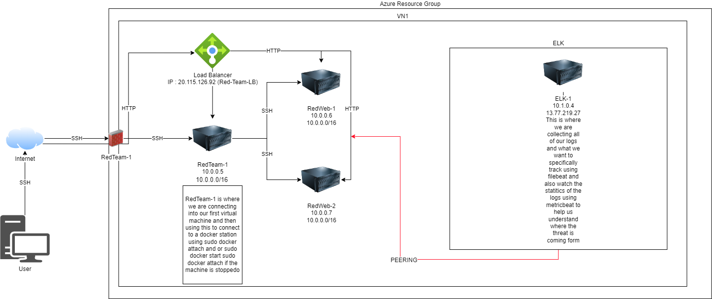
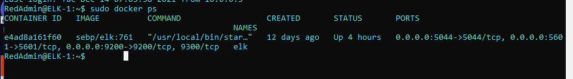

# Automated ELK Stack Deployment

The files in this repository were used to configure the network depicted below.

These files have been tested and used to generate a live ELK deployment on Azure. They can be used to either recreate the entire deployment pictured above. Alternatively, select portions of the **yaml** file may be used to install only certain pieces of it, such as Filebeat.

  [Elkalicous](Ansible/elkalicous.yml)
  
  [pentest](Ansible/pentest.yml)
  
  [ansible-cfg](Ansible/ansbile-cfg.yml)
  
  [hosts](Ansible/hosts.yml)
  
  [Filebeat-playbook](Ansible/filebeat-playbook.yml)
 
  [filebeat-config](Ansible/filebeat-config.yml)
  
  [metricbeat-palybook](Ansible/metricbeat-playbook.yml)
  
  [metricbeat-config](Ansible/MetricbeatConfig.yml)

This document contains the following details:
- Description of the Topologu
- Access Policies
- ELK Configuration
  - Beats in Use
  - Machines Being Monitored
- How to Use the Ansible Build

### Description of the Topology

The main purpose of this network is to expose a load-balanced and monitored instance of DVWA, the D*mn Vulnerable Web Application.

Load balancing ensures that the application will be highly accessable, in addition to restricting non-authorized to the network.
 What aspect of security do load balancers protect? Load balancers can protect you against a Ddos attack due to its ability to split the work between two different servers, allowing one to go down and the system will still be running due to the load balancer now turning all the task back on to only one server instead of both.  What is the advantage of a jump box? The advantage of a jumpbox is that you have only one location that can be used to access multiple location this also allows for very good protection for all other locations you may have

Integrating an ELK server allows users to easily monitor the vulnerable VMs for changes to the event logs and system matrix.
 What does Filebeat watch for? Filebeat is watching for a specific logs and specific set of files you have set.
 What does Metricbeat record? Metricbeat is recording the statics of the files and or logs you have specified for it look. 

The configuration details of each machine may be found below.

| Name     | Function | IP Address | Operating System |
|----------|----------|------------|------------------|
| Jump Box | Gateway  | 10.0.0.5   | Linux            |
| RedWeb1  | Dvwa/WS  | 10.0.0.6   | Linux            |
| Redweb2  | Dvwa/WS  | 10.0.0.7   | Linux            |
| Elk-1    | Elk      | 10.1.0.4   | Linux            |

### Access Policies

The machines on the internal network are not exposed to the public Internet. 

Only the jump box machine can accept connections from the Internet. Access to this machine is only allowed from the following IP addresses:
<enter personal public ip address> in order to connect to the machine you will want to set a rule allowing for your own personal public ip address to pass through the firewall

Machines within the network can only be accessed by RedTeam1(Jump Box).
Which machine did you allow to access your ELK VM? What was its IP address? We access the elk vm from the container were we have our ansible-playbooks. For myself this would the first sudo docker container list -a that I would run and grab the tender_liskov and start the machine then attach myself in order to SSH into the ELK machine.

A summary of the access policies in place can be found in the table below.

| Name     | Publicly Accessible | Allowed IP Addresses |
|----------|---------------------|----------------------|
| Jump Box | Yes/No              | 10.0.0.1 10.0.0.2    |
|          |                     |                      |
|          |                     |                      |

### Elk Configuration

- Ansible was used to automate configuration of the ELK machine. No configuration was performed manually, which is advantageous because...
- What is the main advantage of automating configuration with Ansible? Main advantage would be being able to copy a master copy of the playbook and copying into the container that you want to run it off of. Making it easy for updating the file if need be and makes the tedious changes easy.

- The playbook implements the following tasks:
- The playbook will first install docker.io on to all webservers that have been underlined in the hosts file. after that it will follow and install the rest python3-pip, and - docker module.
- The second task in our playbook will run a systemctl command to insure that the memory that is being used is within a stated amount
- The third task that is being used in our playbook is installing and elk container with certain ports open allowing for us to get into it after succesful download the playbook
  will run its final task
- The final task will be used as a systemd command to ensure that the service that has been installed and configured is up and running with no issues.

The following screenshot displays the result of running `docker ps` after successfully configuring the ELK instance.

### Target Machines & Beats
This ELK server is configured to monitor the following machines:
RedWeb1 - 10.0.0.6
RedWeb2 - 10.0.0.7
  
We have installed the following Beats on these machines:
We installed filebeat in our second playbook, after successfully running Filebeat-playbook we ran a metricbeat-playbook. Running both of these succesfully allowed us to grab the required logs.
These Beats allow us to collect the following information from each machine:
Filebat is collecting the system log information and storing that information into a designated location, and will be readable using kibana.

### Using the Playbook
In order to use the playbook, you will need to have an Ansible control node already configured. Assuming you have such a control node provisioned: 

SSH into the control node and follow the steps below:
- Copy the ansible-playbook file to the designated container.
- Update the host file to include all webservers that you are requesting as well as uncommenting [webservers] and adding underneath your webservers ip addresses you will be adding a [elk] and the elks IP address. Next to all IP addresses you need to include ansible_python_interpreter=/usr/bin/python3.
- Run the playbook, and navigate to Kibana<also the public ip address of the elk server:port address that you opened((5601))> to check that the installation worked as expected.

Answer the following questions to fill in the blanks:_
- Which file is the playbook? Where do you copy it? the playbook to set up elk is elkalicious.yml and you copy this file into the /etc/ansible/directory
- Which file do you update to make Ansible run the playbook on a specific machine? How do I specify which machine to install the ELK server on versus which to install Filebeat on?
- Which URL do you navigate to in order to check that the ELK server is running? In order to check and see if you elk server is up and running you will want to connect to the public ip address of the elk machine in a browser with the open port. so your url should read http://13.77.219.27:5601/app/kibana#/home <this is my url for my machine yours will be different>.
